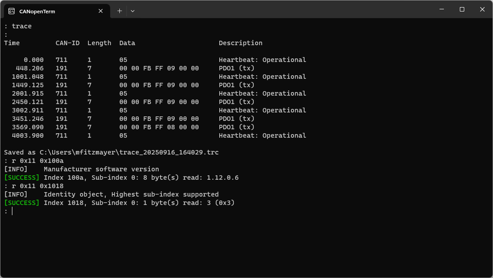
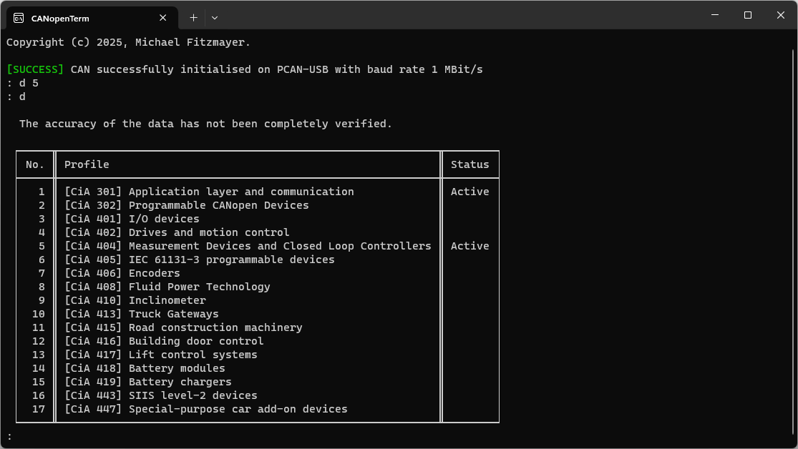

# Origin & Vision

## Motivation and Background

The development, testing, and maintenance of **CANopen CC** devices
depend on diagnostic and configuration tools.  Many available solutions
are designed primarily as commercial products or as a means to promote
specific hardware.  While such tools often provide a comprehensive set
of features, they are also shaped by business considerations, which can
introduce limitations in terms of licensing, extensibility, or hardware
support.

**CANopenTerm** stands apart in this respect. It was not conceived as a
product but emerged directly from practical engineering requirements.
The tool was created to address recurring challenges encountered when
working with CANopen CC networks, and its direction has been guided more
by necessity in daily use than by a defined product strategy.  As an
open-source project, it can also be adapted and extended by others
facing similar needs.

In a nutshell, I created CANopenTerm because it made my work as an
embedded software developer in mobile automation easier. The tool has
since grown beyond its original scope, and its functionality now spans
from network observation and configuration access to automation and
scripting.

In the following sections, the article first outlines the core
capabilities of CANopenTerm, then introduces the JSON-based alternative
to CANopen profile database files, and finally looks ahead to future
directions of this work — including the ongoing development of
CANvenient, a CAN abstraction layer for Windows. I also warmly invite
feedback, ideas, and contributions from anyone interested in supporting
the further evolution of these tools.

## Core Capabilities of CANopenTerm

CANopenTerm combines a set of functions that address the recurring needs
in working with CAN-based communication systems. For monitoring and
analysis, it can display network traffic either as raw CAN frames or as
decoded CANopen CC services using CANopen profile databases.  Captured
traffic can also be replayed to reproduce specific conditions or
evaluate device behaviour. Device configuration is supported through
reading and writing object dictionary entries, including SDO (service
data object) access, NMT (network management) control, and PDO (process
data object) handling. A raw CAN interface is also available, which
makes it possible to work with other CAN-based protocols beyond CANopen
CC.

Beyond interactive use, CANopenTerm includes built-in
**[Lua](/lua-api)** and **[Python](/python-api)** interpreters that
expose similar APIs, making it possible to reproduce test conditions or
integrate CAN interaction into larger workflows. Utilities such as a
**DBC parser** and a JSON-based representation of CANopen profiles
further extend its scope.  Scriptable graphical widgets enable real-time
CAN data visualization, and test results can be exported in **JUnit
XML** format for integration with continuous testing workflows.  These
features complement the core monitoring, configuration, and automation
capabilities.

## A JSON-Based Alternative to CODB

CANopenTerm introduces a JSON-based alternative to the traditional CODB
files, which define CANopen CC device parameters and communication
objects. While CODB is compact and established by CiA, its format is
somewhat antiquated and can be challenging to process or maintain. The
JSON format preserves the same information in a more accessible, robust,
and widely supported structure. In addition, JSON files can be
syntactically validated, which helps reduce errors and simplifies
maintenance.  This approach lays the groundwork for future features such
as automated conformance testing.

## Extending the Ecosystem

Building on the core capabilities of CANopenTerm and the [JSON-based
profile format](codb2json?id=file-format-specification), the project is
now looking ahead to extend its ecosystem. Planned developments include
**[CANvenient](/canvenient)**, a C library that will provide a unified
interface to various manufacturer-specific CAN drivers on Windows. By
reducing fragmentation from proprietary APIs, this open-source library
is intended to simplify CAN hardware access not only for CANopenTerm but
also for other current and future CAN software projects.  Contributions
and feedback from the community are welcome to help shape its evolution.

## Get Involved

As CANopenTerm continues to grow and the ecosystem expands with
initiatives like the JSON-based profile format and the upcoming
CANvenient library, community input becomes increasingly important.
Contributions, feedback, and suggestions are always welcome.  You can
reach out via [email](/legal-information), or visit the project's
[GitHub repository](https://github.com/CANopenTerm/CANopenTerm) to
access the source code, report issues, or participate in development.
Collaboration from the community helps guide future features, improve
functionality, and extend the ecosystem for all users.

— *Michael Fitzmayer, Developer of CANopenTerm*
