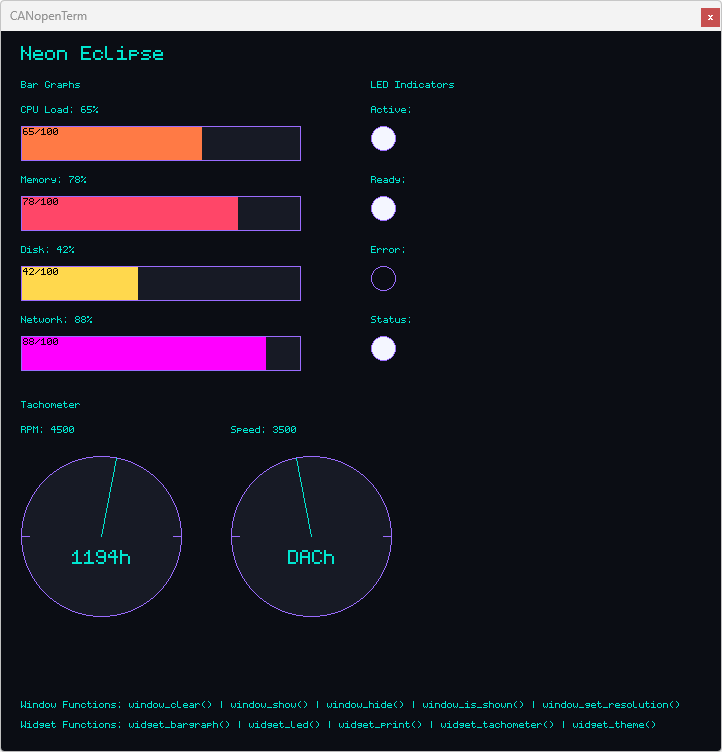
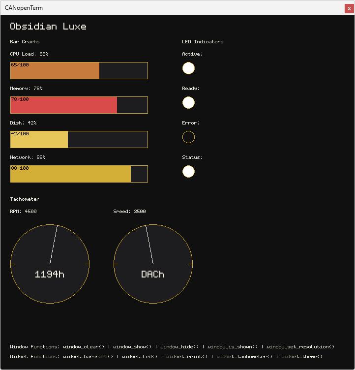
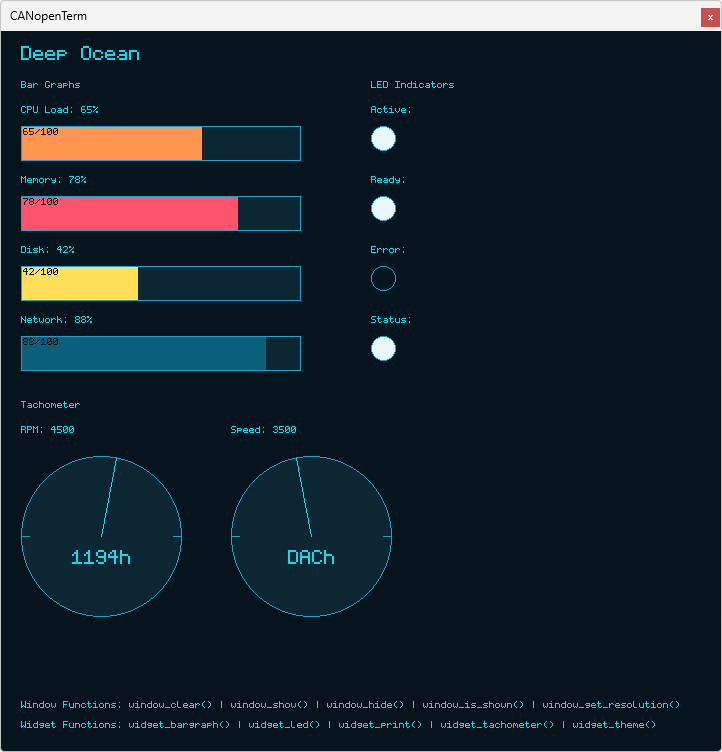
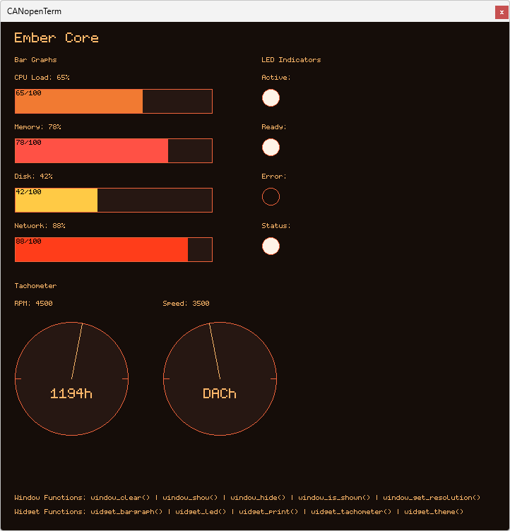
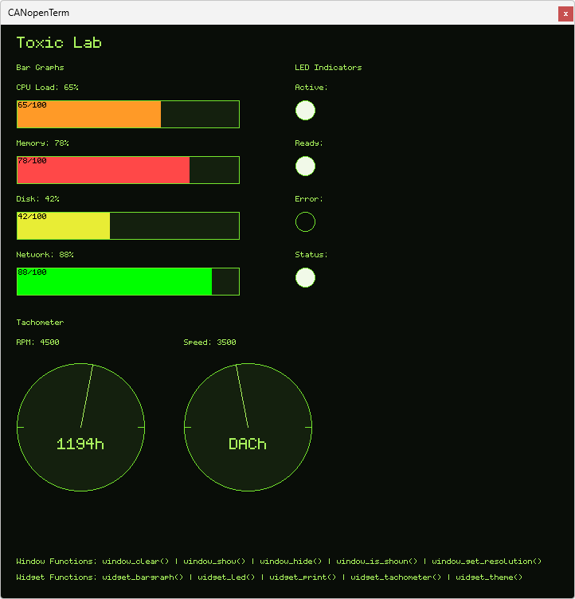
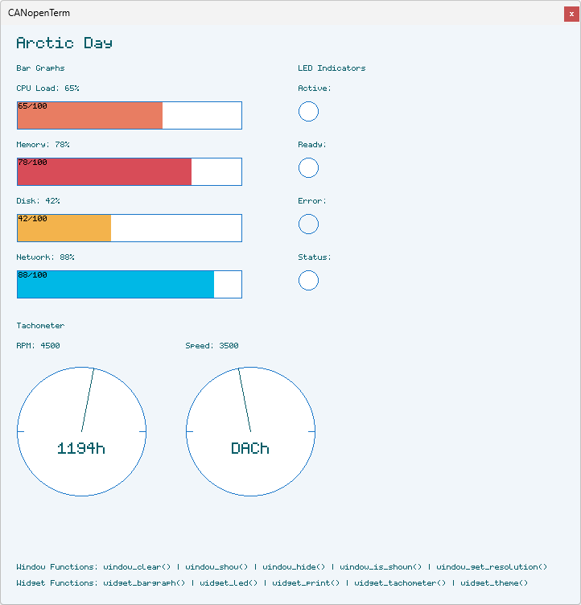
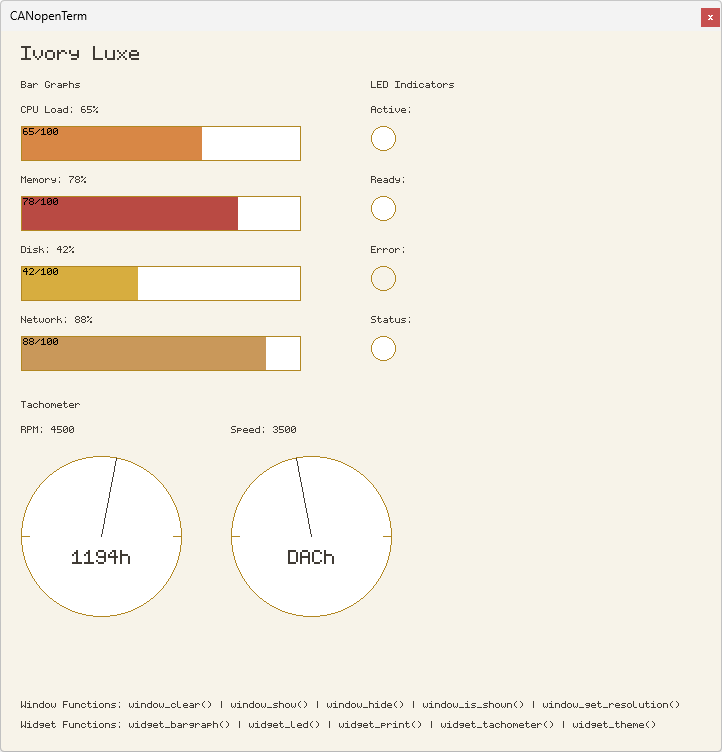
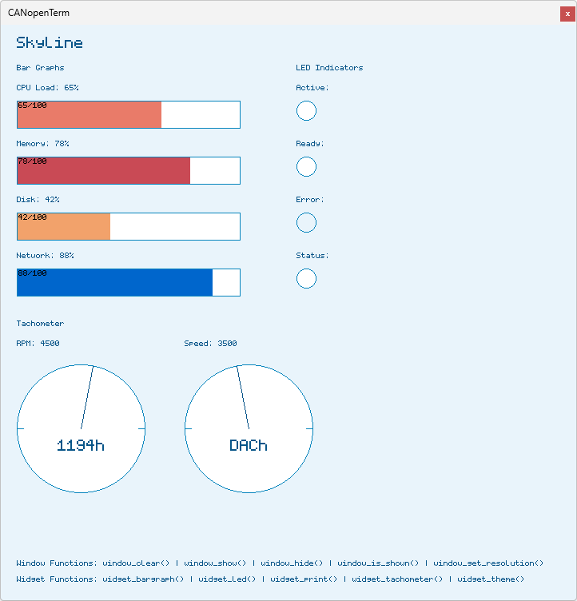
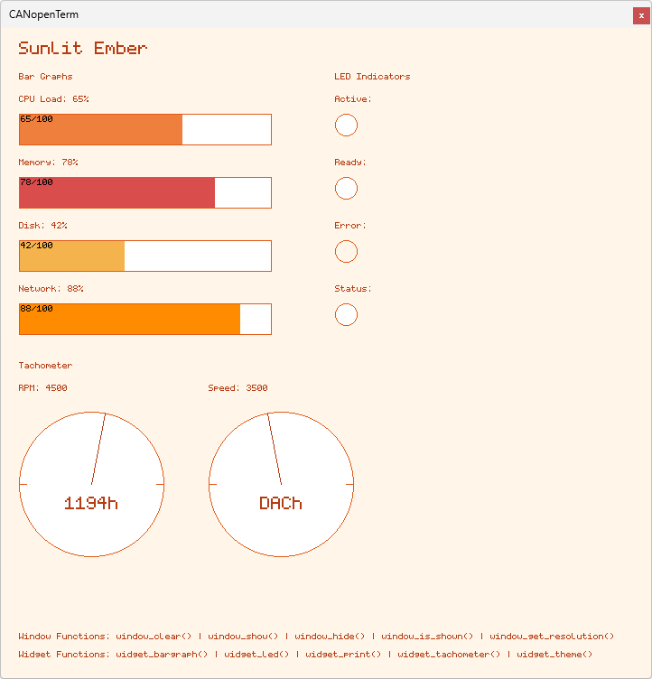
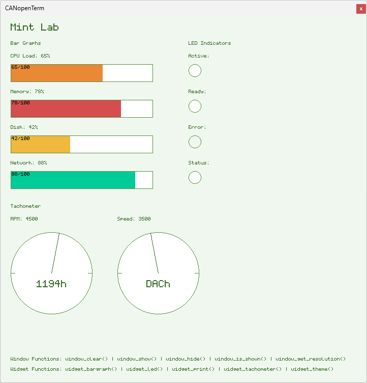

# Themes

## Theme Support

Version 2.4.0 of CANopenTerm introduces themes that allow users to customize
the appearance of scriptable graphical widgets. Themes can be configured using
the newly introduced `widget_theme() API function.

The following theme IDs are currently available:

> - `0` = NEON_ECLIPSE (default, purple/cyan)
> - `1` = OBSIDIAN_LUXE (gold/dark)
> - `2` = DEEP_OCEAN (cyan/blue)
> - `3` = EMBER_CORE (orange/warm)
> - `4` = TOXIC_LAB (green/neon)
> - `5` = ARCTIC_DAY (blue/white)
> - `6` = IVORY_LUXE (cream/gold)
> - `7` = SKYLINE (cyan/blue)
> - `8` = SUNLIT_EMBER (orange/warm)
> - `9` = MINT_LAB (green/mint)

For details how to use the function, please refer to the [Lua](/lua-api.md)
or [Python](/python-api.md) API documentation.

## Theme Previews

Here are previews of the available themes. The screenshots show the same
widget layout with different themes applied.

### Neon Eclipse

### Obsidian Luxe

### Deep Ocean

### Ember Core

### Toxic Lab

### Arctic Day

### Ivory Luxe

### Skyline

### Sunlit Ember

### Mint Lab

