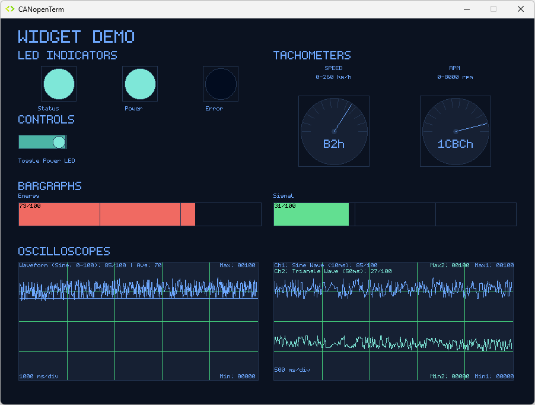
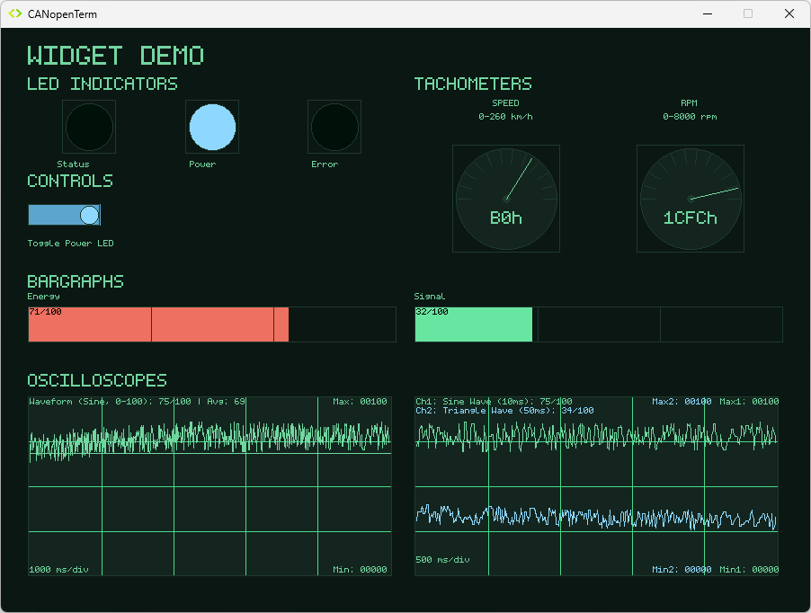
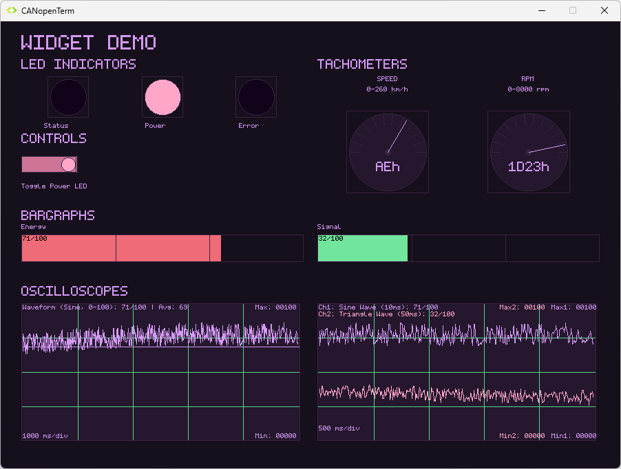
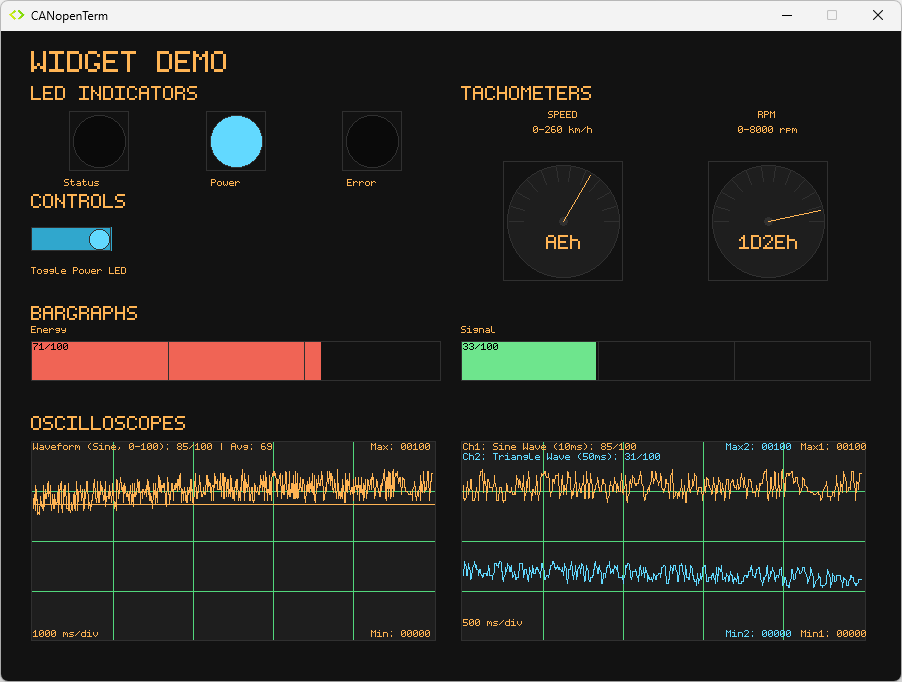
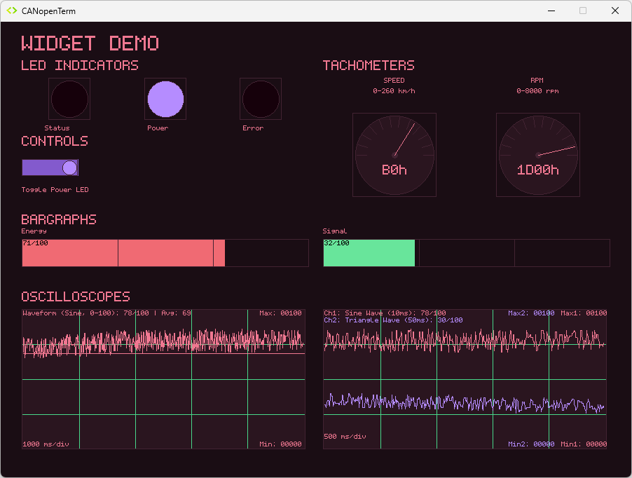
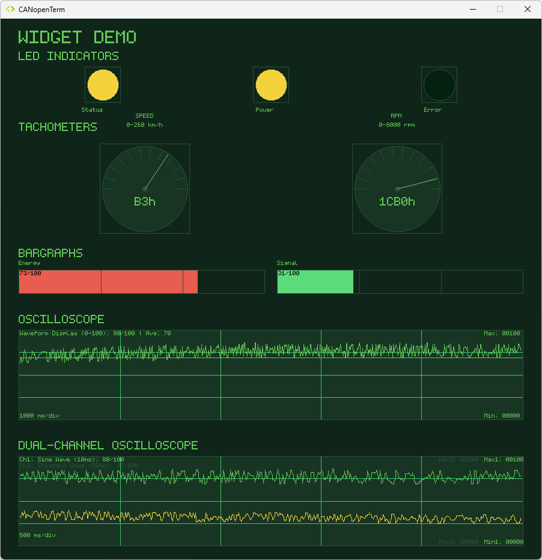
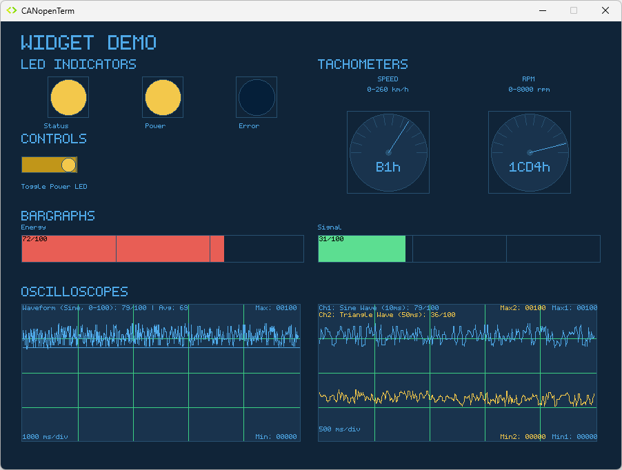
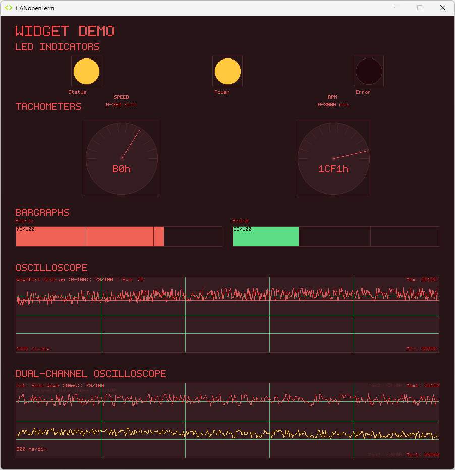
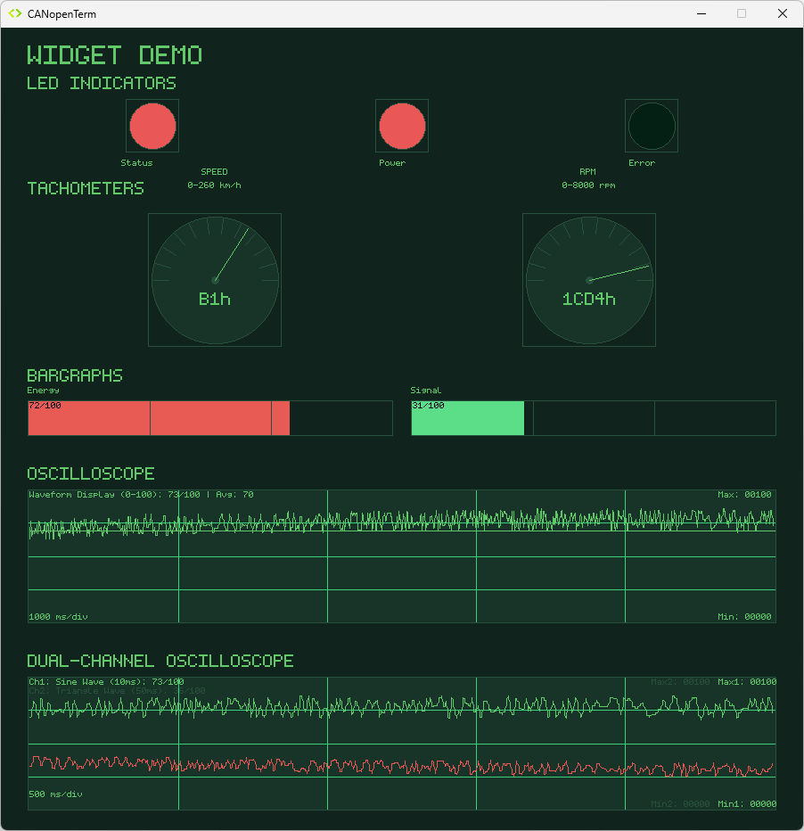
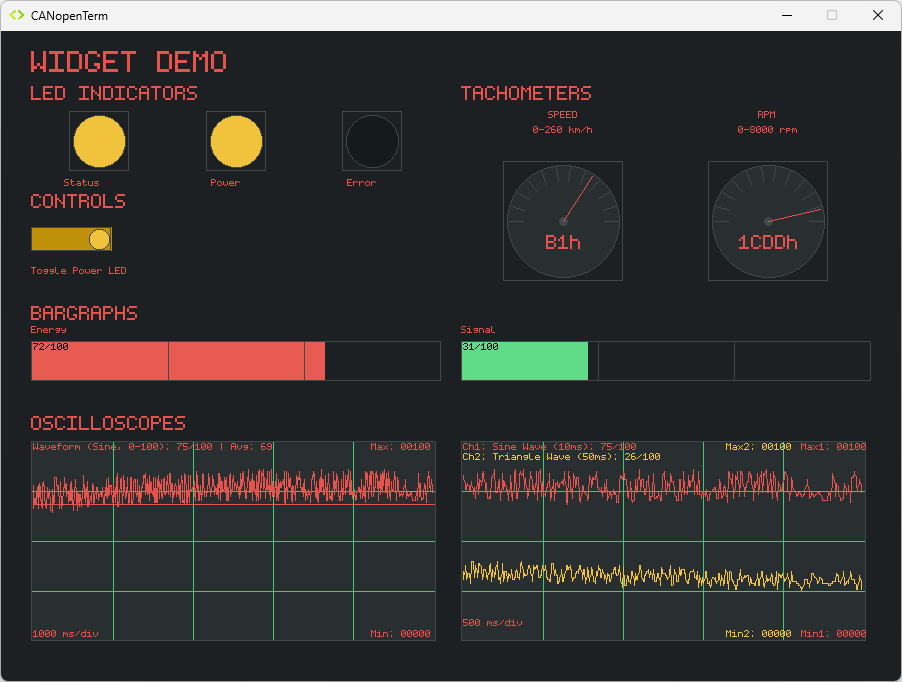

# Themes

## Theme Support

Version 2.4.0 of CANopenTerm introduces themes that allow users to set the
appearance of scriptable graphical widgets. Themes can be configured using
the newly introduced `widget_theme()` API function.

The following theme IDs are currently available:

> - `0` = MIDNIGHT_BLUE (default)
> - `1` = DEEP_FOREST
> - `2` = DARK_PLUM
> - `3` = CHARCOAL_AMBER
> - `4` = DARK_WINE
> - `5` = DEERE_FIELD
> - `6` = NEW_AMSTERDAM
> - `7` = CRIMSON_HARVEST
> - `8` = EMERALD_DRIVE
> - `9` = IRON_HARVEST

For details how to use the function, please refer to the [Lua](/lua-api.md)
or [Python](/python-api.md) API documentation.

## Theme Previews

Here are previews of the available themes. The screenshots show the same
widget layout with different themes applied.

### Midnight Blue

### Deep Forest

### Dark Plum

### Charcoal Amber

### Dark Wine

### Deere Field

### New Amsterdam

### Crimson Harvest

### Emerald Drive

### Iron Harvest

